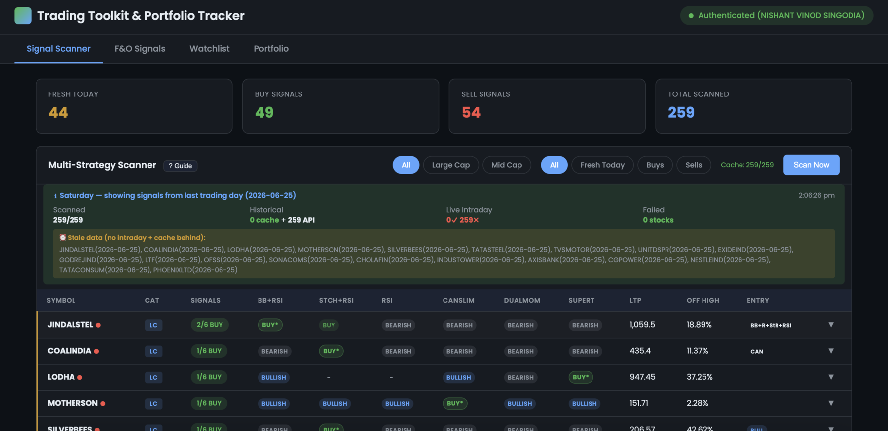
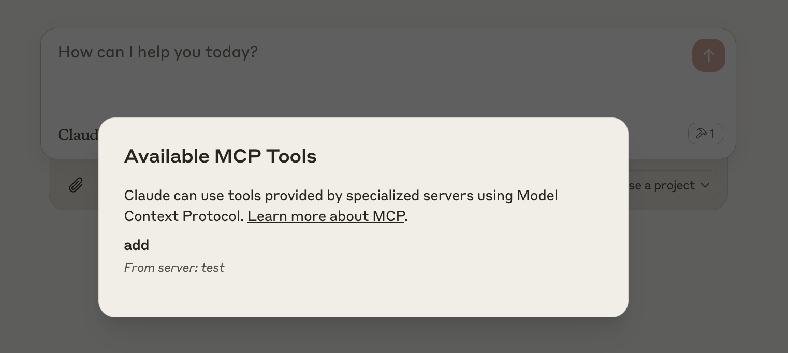

# Trading Toolkit & Portfolio Tracker

> An NSE signal scanner, a trade-attribution portfolio tracker, and two backtesting engines — equity and F&O options — running from a **single Cloudflare Worker** with **no external database**. Started life as an [Upstox](https://upstox.com/) MCP server; grew into a full-stack edge app.

A personal trading-research toolkit for the Indian market, built end-to-end by a product leader who wanted to understand the domain by building it rather than reading about it.

> ⚠️ **Not financial advice.** This is an **educational and personal-research** project. Signals are illustrative and backtest results are an explicit work-in-progress (see [Honest scope & caveats](#honest-scope--caveats)). Trading involves substantial risk of loss. You are solely responsible for any decisions made with this software. Provided "as is", no warranty — see [LICENSE](LICENSE).

**Signal Scanner** — 6 strategies scored across the Indian Stock Market universe, ranked by cross-strategy consensus:



**Portfolio Tracker** — every position and its P&L bucketed by the strategy that triggered the entry, so you can see how each strategy's book is actually performing:


---

## Why I built it

I'm a product leader who works on fintech at scale, and I wanted my own hands on the messy parts: pulling candles through a rate-limited broker API, deciding what a "signal" actually means, modelling trading frictions honestly, and reasoning about where a backtest stops telling the truth. So I built a research tool around a real personal itch — finding and tracking trades — and let it grow from a thin MCP wrapper into a full-stack system. The interesting part isn't any single feature; it's the end-to-end product judgment: scoping, shipping on a constrained runtime, and being candid about what the system can and can't be trusted to say.

---

## What it does

- **Signal Scanner** — scans an NSE large/mid-cap universe (~250 stocks) across **6 curated equity strategies** (BB_RSI, STOCH_RSI, RSI_OBOS, CANSLIM, DUAL_MOM, SUPERTREND), then ranks by cross-strategy consensus. Each stock gets a **fingerprint** summarising every strategy verdict and a signal type — `FRESH_BUY` (today), `RECENT_BUY` (1–3d), `BULLISH`, `BEARISH`, `NEUTRAL`.
- **Portfolio Tracker** — records BUY/SELL trades, computes P&L, and **buckets every position by the strategy that triggered the entry** (the fingerprint is auto-stamped onto the trade), so you can ask "how is my CANSLIM book doing?" rather than just "how is my book doing?"
- **Equity backtester** — a 25+ strategy registry with a parameter optimizer and a strategy-comparison engine, with realistic frictions: next-bar (open) execution to avoid look-ahead, per-side slippage, and an itemized Zerodha equity-delivery cost model (STT, exchange txn, SEBI, stamp duty, DP, GST).
- **F&O options backtester** — a separate **12-strategy** engine (short straddle/strangle, iron condor, iron butterfly, deep-OTM sell, bull-call / bear-put spreads, long straddle, calendar spread, and more) with Black-Scholes pricing, Greeks aggregation, an India expiry calendar, a portfolio risk manager (delta/gamma/vega limits, daily loss cap), and India F&O cost modelling.
- **Upstox MCP server** — natural-language access to your Upstox account (profile, funds/margin, holdings, positions, MTF, order book, order & trade history) from Claude Desktop or Cursor over MCP.
- **Single-page web UI** — 4 tabs: Signal Scanner · F&O Signals · Watchlist · Portfolio.
- **Standard backtest metrics** — CAGR, annualized Sharpe, max drawdown, win rate, profit factor, expectancy (see the caveats on how far to trust the headline numbers).

---

## How it's built

**Stack:** TypeScript · Cloudflare Workers + Durable Objects (embedded SQLite) · Workers KV · Hono · Model Context Protocol (MCP over SSE) · Zod · Upstox REST API + OAuth 2.0 · Vitest · Biome · Wrangler · Python (offline backtest/data scripts).

```
┌─────────────────────────── Cloudflare Worker ───────────────────────────┐
│                                                                          │
│   Static SPA (static/index.html)        MCP endpoint (/sse)              │
│   4 tabs: Scanner · F&O · Watchlist · Portfolio                          │
│                          │                          │                    │
│                          ▼                          ▼                    │
│   ┌──────────────────── Durable Object (MyMCP) ────────────────────┐     │
│   │  REST API · OAuth flow · MCP tool registry                     │     │
│   │  ┌─────────────── embedded SQLite (6 tables) ──────────────┐   │     │
│   │  │ watchlist · candle_cache · scan_snapshots ·             │   │     │
│   │  │ positions · fno_positions · config                      │   │     │
│   │  └─────────────────────────────────────────────────────────┘   │     │
│   └────────────────────────────────────────────────────────────────┘     │
│                          │                                               │
│   KV namespace (OAuth state only)                                        │
└──────────────────────────┼───────────────────────────────────────────────┘
                           ▼
                  Upstox REST API (candles, quotes, holdings, orders)
```

A few decisions I'd call out:

- **Zero external database.** All application state — watchlist, candle cache, scan snapshots, equity + F&O positions, config — lives in SQLite *embedded inside a single Durable Object*. The whole app deploys as one worker; there's nothing else to provision.
- **One pure-function indicator library, shared everywhere.** RSI (proper Wilder's smoothing), SMA/EMA, MACD, Bollinger Bands, Stochastic, Supertrend, ATR — all arrays-in / arrays-out, used identically by the live scanner and the backtester so a signal means the same thing in research and in production.
- **A data layer that survives a flaky, rate-limited broker.** Upstox 429s after a burst of requests, so candles are fetched in batches of 3 with 1s spacing and exponential-backoff retry, on top of a rolling 1-year cache with gap-fill. A full ~250-stock scan takes ~90s and runs *inside* the Durable Object to sidestep the Workers 30s request timeout.
- **Attribution baked into the data model.** The consensus fingerprint is computed at scan time and stamped onto every trade, so the portfolio can be sliced by originating strategy rather than reverse-engineered later.
- **Tested.** ~270 Vitest cases across the MCP tools, the equity engine, and the F&O engine (indicators, strategies, pricing, metrics, risk-manager, expiry-calendar).

---

## The 6 equity strategies

| Strategy | BUY signal | SELL signal |
|----------|-----------|-------------|
| **BB_RSI** | Price ≤ lower Bollinger Band **and** RSI < 30 | Price ≥ mid band **or** RSI > 70 |
| **STOCH_RSI** | %K < 20, RSI < 35, %K crosses %D up | %K > 80, RSI > 65, %K crosses %D down |
| **RSI_OBOS** | RSI crosses above 30 | RSI crosses below 70 |
| **CANSLIM** | Price > SMA50, volume > 1.5× avg, near 52-week high, RSI 50–80 | Price < SMA50 |
| **DUAL_MOM** | Price > SMA200, top 75% of 52-week range, MACD > 0 | Price < SMA200 **or** MACD < 0 |
| **SUPERTREND** | Price crosses above Supertrend(10, 3) | Price crosses below |

---

## Honest scope & caveats

This section is deliberately blunt, because intellectual honesty about a model is the point. I ran a correctness audit on my own toolkit; the **signal/indicator math is sound, but the reported P&L and returns are not yet trustworthy.** Treat them as a work-in-progress, not credible performance numbers, and never as investment advice.

- **Backtest P&L / CAGR / Sharpe are not investment-grade.** The metric functions themselves are individually correct, but they inherit the equity curve they're fed — and that curve has the issues below — so the headline percentages are directional at best.
- **The portfolio tracker can misstate realized P&L.** Trade import/dedup keys on `(symbol, action, price, quantity, trade_date)` and P&L is gross sell-revenue minus buy-cost rather than **FIFO lot matching**, which can double-count. Fixing this to proper FIFO is the known next step.
- **The F&O backtester uses _synthetic_ option prices.** There is no real historical option-chain data — premiums are Black-Scholes from spot + a backward-looking IV estimate, with no bid-ask spread. My own [`fno-backtester/AUDIT.md`](fno-backtester/AUDIT.md) catalogues this and other issues as CRITICAL/HIGH and concludes that **all absolute F&O P&L figures are directional indicators at best, not forecasts.** What it *is* good for: relative ranking of strategies, win-rate patterns, regime behavior, and finding strategies to avoid.
- **Single-user, local-first.** Runs at `localhost:8787`; no multi-tenant auth, no live deployment URL. It depends on a personal Upstox account and a ~6-hour OAuth token (which has silently expired on me before — token-expiry handling exists because of that).
- **The "one worker" story is the core app.** Some peripheral local tooling reaches outside the Worker (e.g. a sync endpoint that talks to `localhost:9876`); the single-deployable-worker claim is about the scanner/portfolio/MCP core, not the full local toolchain.

---

## Run it locally

```bash
git clone https://github.com/nishantsingodia/trading-toolkit-portfolio-tracker.git
cd trading-toolkit-portfolio-tracker
npm install
```

Create `.dev.vars` with your Upstox app credentials (see `.dev.vars.example`):

```
UPSTOX_API_KEY=your_api_key
UPSTOX_API_SECRET=your_api_secret
UPSTOX_ACCESS_TOKEN=your_access_token
```

> 🔒 `.dev.vars` is gitignored. Credentials are read from the environment, never hardcoded.

```bash
npm run start   # wrangler dev on http://localhost:8787
npm test        # ~270 Vitest cases
```

Open `http://localhost:8787` for the UI, or point an MCP client at `/sse`. Authenticate via the badge in the UI (Upstox OAuth → token saved to the embedded DB).

### MCP client config

**Claude Desktop**
```json
{
  "mcpServers": {
    "mcp-server-upstox-api": {
      "command": "npx",
      "args": ["mcp-remote", "http://localhost:8787/sse"]
    }
  }
}
```

**Cursor** (`~/.cursor/mcp.json`)
```json
{
  "mcpServers": {
    "mcp-server-upstox-api": { "url": "http://localhost:8787/sse" }
  }
}
```

Example prompts: _"What's my available margin in the equity segment?"_ · _"What stocks do I hold and their current values?"_ · _"What are my open positions and unrealized P&L?"_ · _"Show me the trades for order ID `xxx`."_

---

## API & MCP reference

**REST routes**

| Route | Method | Description |
|-------|--------|-------------|
| `/api/scan?category=ALL` | GET | Run the full 6-strategy scan |
| `/api/watchlist` | GET | List watched stocks |
| `/api/trade` | POST | Record a BUY/SELL with its signal strategy |
| `/api/positions` | GET | Portfolio P&L (`?portfolio=STRATEGY`) |
| `/api/cache/status` | GET | Candle-cache stats |
| `/api/cache` | DELETE | Force a cache refresh |
| `/api/fno/scan` | GET | F&O options-chain analysis |

**Upstox MCP tools:** `get-profile` · `get-funds-margin` · `get-holdings` · `get-positions` · `get-mtf-positions` · `get-order-book` · `get-order-details` · `get-order-trades` · `get-order-history` · `get-trades`

---

## Project structure

```
src/
  index.ts              # Entry point — REST routes, OAuth, MCP tool registration
  tools/
    watchlist.ts        # Scan engine: 6 strategy classifiers, indicators, candle cache
    portfolio.ts        # Trade recording, P&L, position bucketing
    get-*.ts            # MCP tool wrappers for Upstox endpoints
    run-backtest.ts     # Equity backtest runner
    run-fno-backtest.ts # F&O backtest runner
  data/stock-master.ts  # NSE universe with instrument keys
  constants/            # API base URL, headers
static/index.html       # Single-page UI (Scanner · F&O · Watchlist · Portfolio)
backtester/             # Equity engine (10-strategy registry + optimizer)
fno-backtester/         # 12-strategy F&O engine + AUDIT.md (pricing, risk, expiry)
```

---

## MCP integration, in action




---

## About the author

Built by **Nishant Singodia** — Director of Product (7+ yrs), B.Tech IIT Kharagpur, based in Mumbai. I lead revenue, payments, and platform products at consumer-fintech scale (Dream11, ~250M+ users; founding product at an AI-first SEBI-registered broking platform), and I build 0→1 myself — this repo is one of those builds.

[GitHub](https://github.com/nishantsingodia) · [LinkedIn](https://linkedin.com/in/nishantsingodia) · nishantsingodia@gmail.com

## License

[MIT](LICENSE) © Nishant Singodia
